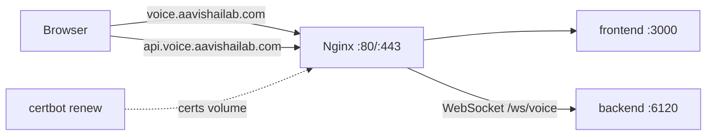

# Production deployment (Docker + Nginx + Certbot)

Deploy the full stack on an Ubuntu VPS with:

| Service | Public URL | Internal port |
|---------|------------|-----------------|
| Frontend | `https://voice.aavishailab.com` | 3000 |
| Backend API + WebSocket | `https://api.voice.aavishailab.com` | **6120** |

Nginx terminates TLS. Certbot issues and renews Let's Encrypt certificates.

---

## Prerequisites

1. **Ubuntu VPS** with Docker Engine and Docker Compose v2.
2. **DNS** (at your registrar):
   - `voice.aavishailab.com` → VPS public IP (A record)
   - `api.voice.aavishailab.com` → VPS public IP (A record)
3. **Firewall**: allow inbound **80** and **443** only (do not expose 6120 or 3000 publicly).
4. API keys: [Groq](https://console.groq.com), [Sarvam](https://dashboard.sarvam.ai).

---

## One-command first deploy

On the VPS, clone the repo and run:

```bash
cd /path/to/voice-ai-agent

chmod +x deploy/setup-env.sh deploy/bootstrap.sh
./deploy/setup-env.sh
```

Edit `.env` and set **only** your secrets (domains and URLs are already filled):

```bash
nano .env
```

Required:

```env
GROQ_API_KEY=gsk_...
SARVAM_API_KEY=...
CERTBOT_EMAIL=you@aavishailab.com
```

Then run the full bootstrap (build → HTTP → SSL → HTTPS + renewal):

```bash
./deploy/bootstrap.sh
```

When it finishes:

- App: https://voice.aavishailab.com  
- API / WS: https://api.voice.aavishailab.com and `wss://api.voice.aavishailab.com/ws/voice`

---

## What gets configured automatically

`./deploy/setup-env.sh` creates or updates the root `.env` from `deploy.env.example` (and copies `GROQ_API_KEY` / `SARVAM_API_KEY` from `backend/.env` if present):

| Variable | Value |
|----------|--------|
| `FRONTEND_DOMAIN` | `voice.aavishailab.com` |
| `BACKEND_DOMAIN` | `api.voice.aavishailab.com` |
| `BACKEND_PORT` | `6120` |
| `CORS_ORIGINS` | `https://voice.aavishailab.com` |
| `NEXT_PUBLIC_API_URL` | `https://api.voice.aavishailab.com` |
| `NEXT_PUBLIC_WS_URL` | `wss://api.voice.aavishailab.com/ws/voice` |

Re-run `./deploy/setup-env.sh` anytime to refresh derived URLs without touching API keys.

---

## Manual steps (equivalent to bootstrap)

```bash
./deploy/setup-env.sh
# edit .env with API keys + CERTBOT_EMAIL

docker compose build
docker compose up -d backend frontend nginx

# Issue certificate (nginx must be running on port 80)
docker compose run --rm certbot-init

# Switch nginx to HTTPS configs
# Set NGINX_CONF_DIR=conf.d.ssl in .env (bootstrap does this), then:
docker compose up -d nginx certbot
```

---

## Day-2 operations

### Start / stop

```bash
docker compose up -d
docker compose down
```

### Rebuild after code changes

```bash
./deploy/setup-env.sh
docker compose build --no-cache
docker compose up -d
```

Frontend `NEXT_PUBLIC_*` values are baked in at **build** time. After changing API/WS URLs in `.env`, rebuild the frontend image.

### Logs

```bash
docker compose logs -f nginx
docker compose logs -f backend
docker compose logs -f frontend
docker compose logs -f certbot
```

### Health checks

```bash
curl -sS https://api.voice.aavishailab.com/health
curl -sS -o /dev/null -w "%{http_code}\n" https://voice.aavishailab.com
```

### SSL renewal

The `certbot` service runs `certbot renew` every 12 hours.

After renewal, reload nginx so it picks up new certs:

```bash
docker compose exec nginx nginx -s reload
```

Optional host cron (daily reload at 03:15):

```cron
15 3 * * * cd /path/to/voice-ai-agent && docker compose exec -T nginx nginx -s reload
```

### Re-issue certificates

```bash
docker compose run --rm certbot-init
docker compose exec nginx nginx -s reload
```

---

## Architecture



---

## Troubleshooting

| Problem | Fix |
|---------|-----|
| Certbot fails | Confirm DNS points to this server; port 80 reachable; `CERTBOT_EMAIL` set. |
| Nginx won't start after SSL | Certs missing — run `docker compose run --rm certbot-init` first. |
| WebSocket fails | Use `wss://api.voice.aavishailab.com/ws/voice`; check nginx `api` SSL config. |
| CORS errors | `CORS_ORIGINS` must be `https://voice.aavishailab.com`; restart backend. |
| 502 on API | `docker compose logs backend`; verify `GROQ_API_KEY` / `SARVAM_API_KEY`. |

---

## Files

| Path | Role |
|------|------|
| `docker-compose.yml` | All services |
| `deploy.env.example` | Env template |
| `deploy/setup-env.sh` | Auto-generate `.env` URLs |
| `deploy/bootstrap.sh` | First-time SSL + start |
| `deploy/nginx/conf.d.http/` | HTTP-only (ACME + proxy) |
| `deploy/nginx/conf.d.ssl/` | HTTPS + redirect |
| `backend/Dockerfile` | FastAPI on port 6120 |
| `frontend/Dockerfile` | Next.js standalone |
